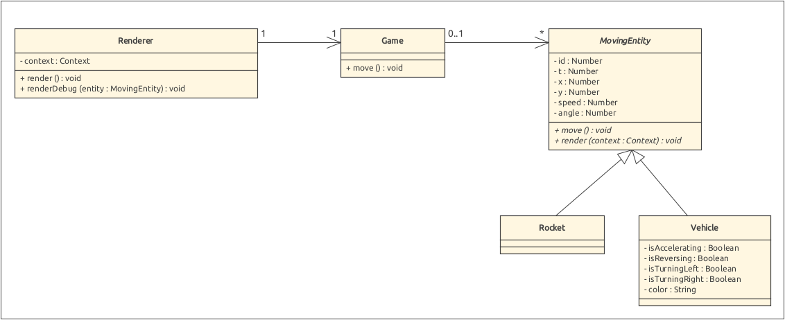
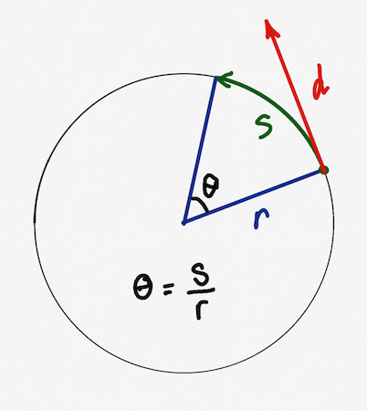

# Exercise 3

You are asked to implement the domain model of the video game in javascript using classes.



Notice that the design of this model is constrained by the end result that includes networking features as well as the possibility to introduce a new renderer. 
- The `app.js` file initializes the game and the renderer, the `setInterval` and `requestAnimationFrame` method calls must be completed.
- The `constant.js` file contains constants used across the application.
- The `game.js` provides the `Game` class: its `move()` method updates the state of all the game objects at every tick (every 10ms in our case).
- The `renderer.js` file provides the `Renderer` class: its `render()` method must render the state of the game in the canvas whenever the CPU is available. [Transformations](https://developer.mozilla.org/en-US/docs/Web/API/Canvas_API/Tutorial/Transformations) should be used to initialize the drawing context (canvas) in the `renderer.js` file. Notice that the `Renderer` contains a `renderDebug(entity)` method that might help you in debugging the application.
- The `model.js` file provides the `MovingEntity`, `Rocket` and `Vehicle` classes: their constructors take all their properties as arguments.

The Mocha **test cases** are provided as implementation guidelines and partially cover the classes in the `model.js` file. 
The rendering methods in `renderer.js` and `model.js` are not covered by the test cases, but their effect will be checked manually in the browser during the correction.

The exercise can more easily be achieved by doing the tasks in the following order.
- Create the MovingEntity class and check if it passes the unit tests.
- Create the Rocket class and check if it passes the unit tests.
- Implement the game loop (`setInterval`) so that it updates the state of the game.
- Implement the rendering loop (`requestAnimationFrame`) so that it draws the game in the canvas.
- Go back and forth and check the result in the browser until the rockets start moving.
- Replicate the process to implement the Vehicle class.

The behavior of the `Rocket` is straightforward to implement.
Make sure to carefully check the units.
For instance, the time increases by the value of the `tick` constant (10ms). The distance is also the speed (expressed in pixels per seconds) multiplied by the duration (expressed in milliseconds). 

The behavior of the `Vehicle` is more difficult to implement, it is a good idea to make some drawings before implementing its move function.
For instance, in the following doodle, the distance following a straight line corresponds to `d`, and the `steeringRadius` constant  corresponds to `r`.
Notice that a debug function is provided in the renderer.



The following guidelines describe how the state of a vehicle may change at every tick:
- the time increases by the value of the `tick` constant (10ms).
- The speed is multiplied by the `friction` constant.
- The speed is incremented by the `acceleration` constant if the vehicle is accelerating.
- The speed is decremented by the `reverse` constant if the vehicle is reversing.
- The final speed is used to compute the distance traveled during a tick.
- The `steeringRadius` constant and the distance are used to calculate the steering angle.
- The steering angle can be used to deduce by how much the angle of the vehicle should be incremented (right) or decremented (left).
- The available information can finally be used to compute the new position.

The rockets (circles) and vehicles (rectangles) are rendered with the `arc(...)` and `lineTo(...)` methods of the drawing context.
The difficulty consists in placing the object correctly using the `save`, `translate`, `rotate` and `restore` methods of the context.
This should be done by the `Renderer` in the `render()` method.

All your modifications should take place in the files `src/app.js`, `src/renderer.js`, and `src/model.js` files, which contain TODO placeholders.
For the corrections, we will check that you project passes the tests and visually verify in the browser that the objects initialized in the `app.js` file are moving like in the [demonstration video](demo.mov).

## Setup

Install project dependencies
```sh
npm install
```

Start the server
```sh
npm run start

# or start server in watch mode
# so it automatically restarts on file changes
npm run watch
```

Run tests
```
npm run test
```

## Constructor signature

### Moving entity

```javascript
class MovingEntity {
/**
* Construct a MovingObject.
* @param {*} id The identifier.
* @param {*} t The time t in milliseconds.
* @param {*} x The x coordinate.
* @param {*} y The y coordinate.
* @param {*} speed The speed expressed in pixels/second.
* @param {*} angle The angle expressed in radians.
  */
constructor(id, t, x, y, speed, angle) {}
```

### Rocket
```javascript
class Rocket extends MovingEntity {
/**
* Construct a Rocket.
* @param {*} id The identifier.
* @param {*} t The time t.
* @param {*} x The x coordinate.
* @param {*} y The y coordinate.
* @param {*} speed The speed expressed in pixels/second.
* @param {*} angle The angle expressed in radians.
  */
constructor(id, t, x, y, speed, angle) {}
```

### Vehicule
```javascript
/**
 * A class for representing vehicles.
 * @augments MovingEntity
 */
class Vehicle extends MovingEntity {
  /**
   * Construct a Vehicle.
   * @param {*} id The identifier.
   * @param {*} t The time t.
   * @param {*} x The x coordinate.
   * @param {*} y The y coordinate.
   * @param {*} speed The speed expressed in pixels/second.
   * @param {*} angle The angle expressed in radians.
   * @param {*} color The color expressed in RGB hex code.
   */
constructor(id, t, x, y, speed, angle, isAccelerating, isReversing, isTurningLeft, isTurningRight, color) {}
```
